<div align="center">

# GridSetu

**A neighbourhood reliability reserve for India's low-income feeders, built to plug into Schneider Electric's grid, not replace it.**

Schneider Electric Yuva Yodha Energy Tech Hackathon · Challenge 03: Grid reliability and renewable intermittency

[Live demo](https://claude.ai/artifact/212NufWD9xhznBwTKwGAYc) · [Run it locally](#run-it-locally) · [How it works](#how-it-works) · [Results](#results)


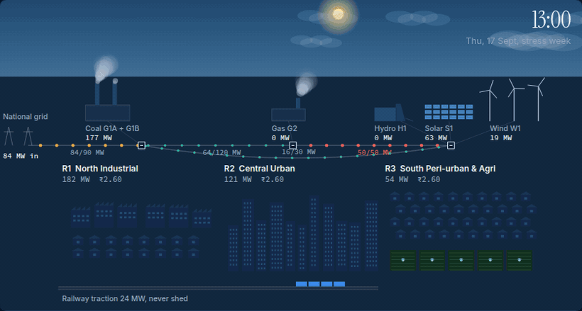

<sub>Thursday of the stress week, 13:00 to midnight. Power flows from the plants along the 220 kV ring into three districts. At 18:00 coal unit G1B trips, prices hit the ₹10 ceiling, and the DISCOM starts shedding load (amber wash, dark windows). Railways and municipal water stay on.</sub>

</div>

> **Everything here is simulation on synthetic data, not field measurement.** Every input is an engineering assumption in [`config/city.yaml`](config/city.yaml) and can be changed there.

---

## Contents

- [The problem](#the-problem)
- [What GridSetu does](#what-gridsetu-does)
- [The dashboard](#the-dashboard)
- [How it works](#how-it-works)
- [Results](#results)
- [Run it locally](#run-it-locally)
- [Project structure](#project-structure)
- [Modelling assumptions](#modelling-assumptions)
- [Limitations](#limitations)
- [Roadmap](#roadmap)

---

## The problem

On a peri-urban feeder, rooftop solar fades just as the evening demand peak arrives (17:30 to 19:30). The distribution transformer overloads and trips. On a stressed grid day the DISCOM also sheds whole feeders in rotation. When that happens every home goes dark, including the health sub-centre, the school and the water pump.

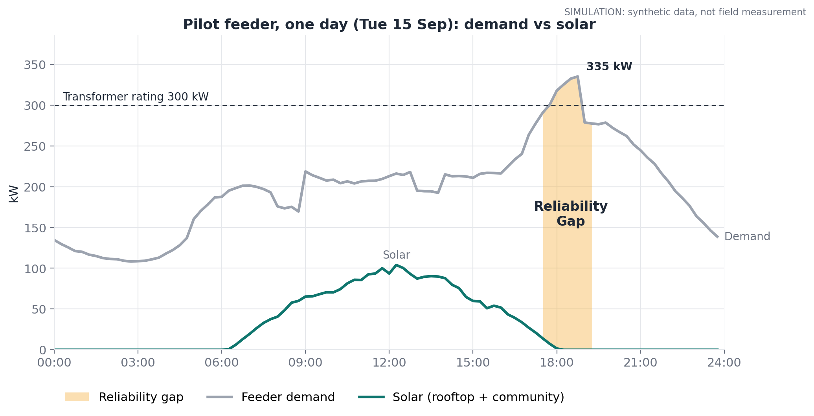

Schneider's EcoStruxure ADMS/DERMS already dispatches DERs it has a metered, contracted relationship with. A cooperatively shared community battery serving 420 unrelated low-income households has no single customer of record, so it never becomes dispatchable. GridSetu is the missing origination layer: it turns that feeder's shared assets into one forecasted, confidence-scored **Reliability Reserve** and publishes it to the ADMS through its own interfaces.

## What GridSetu does

| | Baseline feeder | Feeder with GridSetu |
|---|---|---|
| Evening peak | Transformer overloads and trips | Battery shaves the peak under the rating |
| DISCOM asks for relief | Whole feeder tripped in rotation | Relief delivered from battery, then Tier-3, then consented Tier-2 loads |
| Relief not possible | Feeder dark | Feeder tripped, **critical loads islanded on the battery** |
| Who carries curtailment | Everyone, all at once | Rotated by a fairness ledger; no home twice in a row |
| What the control room sees | Nothing until it fails | A reserve with kW, duration, confidence and cost, updated at T−24h, T−1h, T−15min, real time and post-event |

**Load tiers on the pilot feeder**
- **Tier 1, critical:** health sub-centre, school, water pumping, street lighting. Never curtailed; islanded on the battery if the feeder trips.
- **Tier 2, important:** micro-enterprise motors. Shifted only with prior opt-in (26 of 35 workshops).
- **Tier 3, flexible:** AC boost, water heating, two-wheeler charging. Paused in 15-minute slots by the fairness ledger, and any household can override.

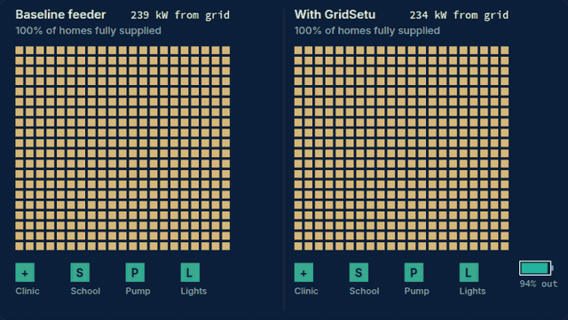

<sub>The same 420 homes through Thursday evening. Left: the baseline feeder is tripped in rotation and every home goes dark. Right: GridSetu pauses Tier-3 appliances (teal outlines), rotating which homes carry it. When the DISCOM's request exceeds what the feeder can give, it is tripped too, but the clinic, school, pump and street lights stay on the battery.</sub>

---

## The dashboard

A React control room over a FastAPI service. Every page is driven by one shared playhead, so scrubbing the week moves the city animation, the feeder, every chart cursor and the live readouts together.

### Control room

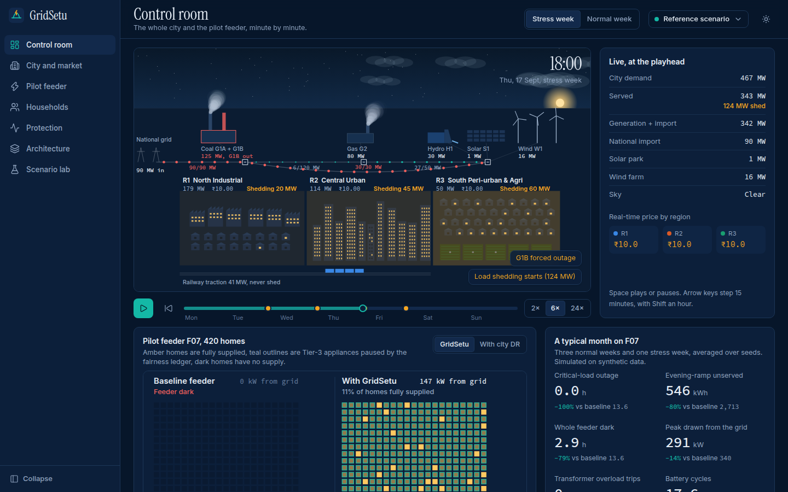

- **City scene (canvas):** plants, the 220 kV ring with moving dots whose speed and direction follow the MW, and districts whose windows go dark in proportion to the load shed in that class. The sky follows the simulated hour and cloud cover.
- **Pilot feeder inset:** 420 homes side by side, baseline against GridSetu.
- **Month KPIs:** tween to their new values when a different run is selected.
- **Playback:** Space plays or pauses. Arrow keys step 15 minutes, and Shift+arrow steps an hour. Clicking any chart seeks there.

<details>
<summary><b>Light theme and phone layout</b></summary>

<br>

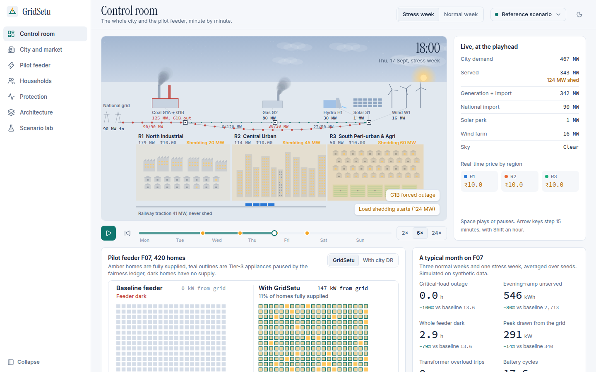 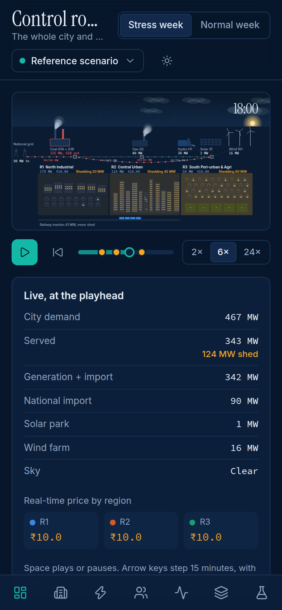

</details>

### City and market

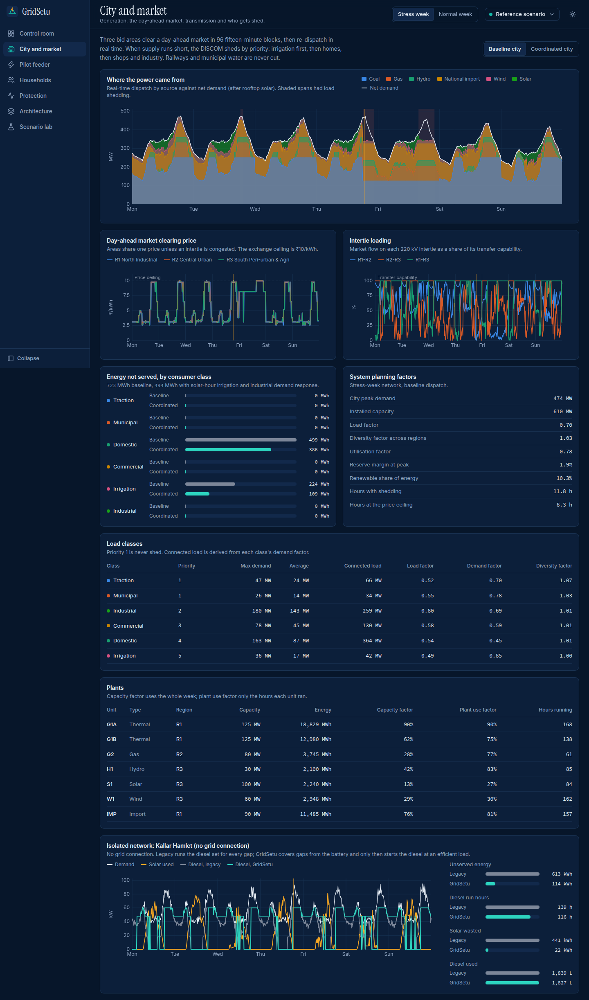

Dispatch by source against net demand, day-ahead market clearing price per bid area, intertie loading, energy not served by consumer class, and the planning tables:
- **Load classes:** load, demand and diversity factors.
- **Plants:** capacity and plant use factors.
- **Isolated microgrid:** legacy against GridSetu dispatch for the off-grid hamlet.

### Pilot feeder and the Reliability Reserve

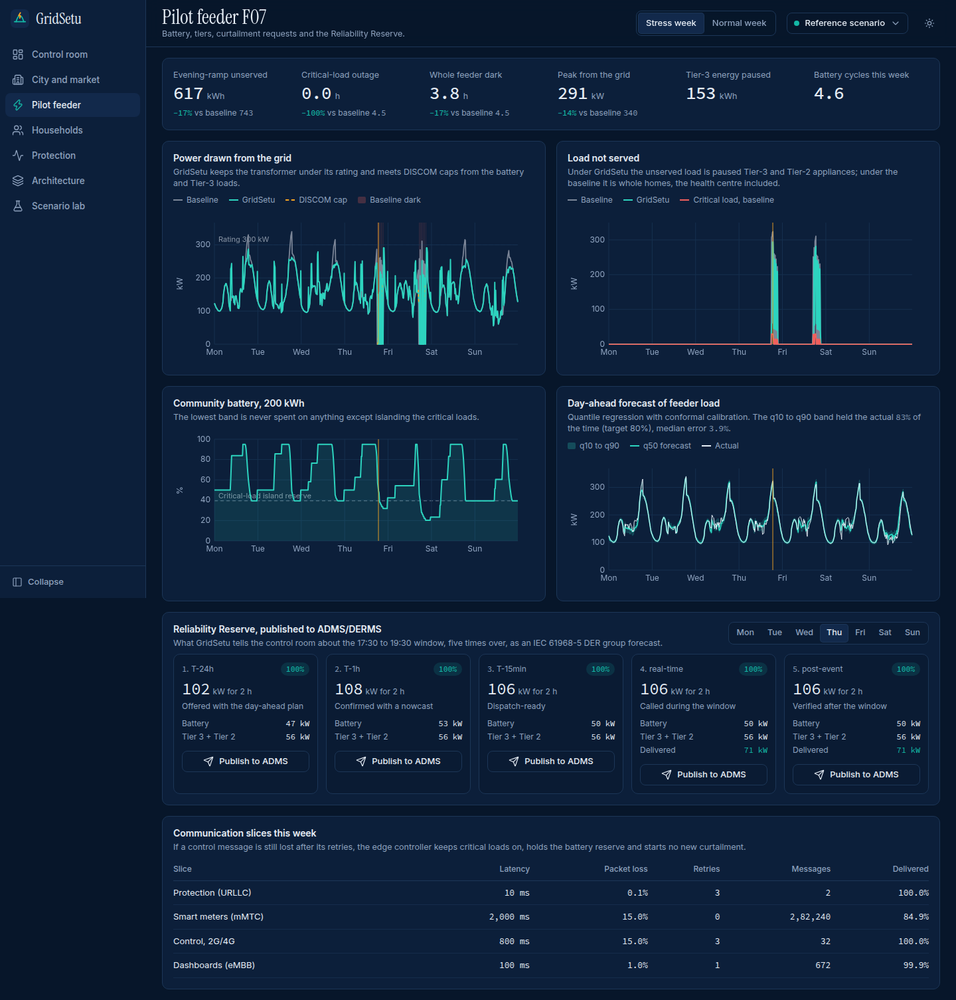

The Reliability Reserve card shows what GridSetu tells the control room about each evening window at five stages. **Publish to ADMS** posts it to a mock EcoStruxure ADMS/DERMS ingest endpoint, shaped as an IEC 61968-5 DER group forecast, and shows the acknowledgement.

### Households and fairness

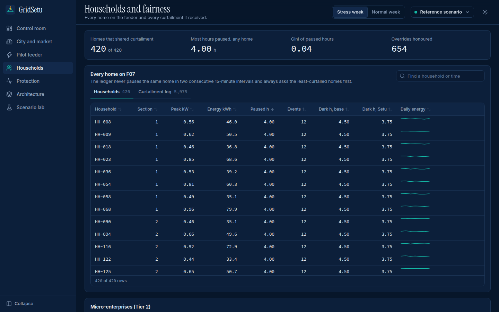

All 420 homes and the complete curtailment log (about 6,000 rows) in virtualised, sortable, searchable tables. Clicking a home opens its week as a strip: supplied, Tier-3 paused, or dark, under both scenarios.

### Protection (WAMS)

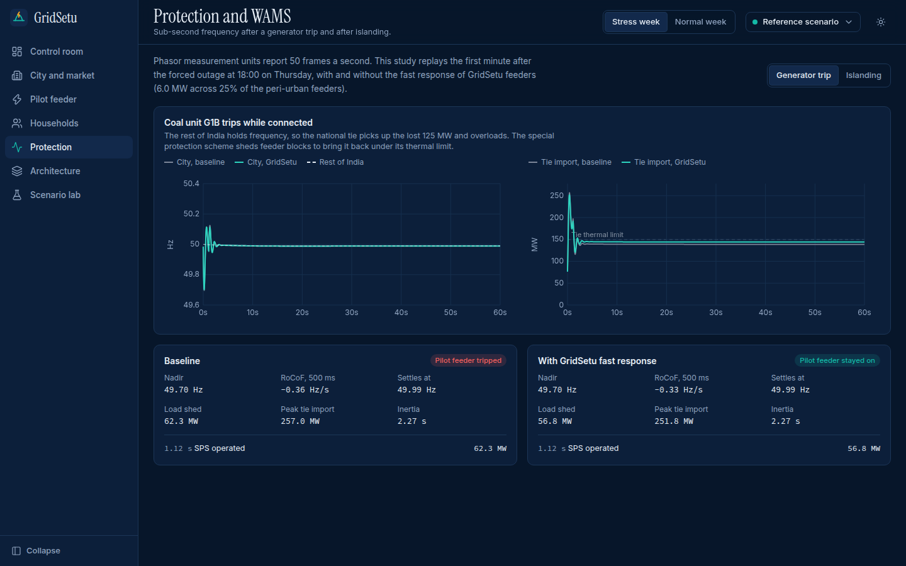

The first minute after the forced outage at 50 frames per second:
- **Case A, generator trip:** the national tie picks up the loss and the special protection scheme sheds load.
- **Case B, islanding:** the city is cut off from the national grid and under-frequency relays shed load in stages.

### Architecture and scenario lab

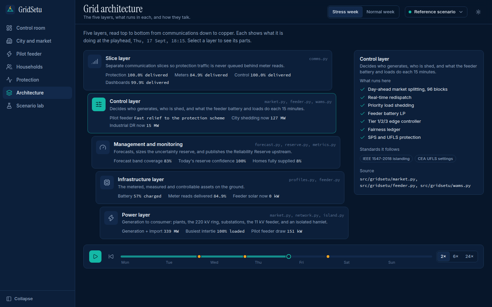 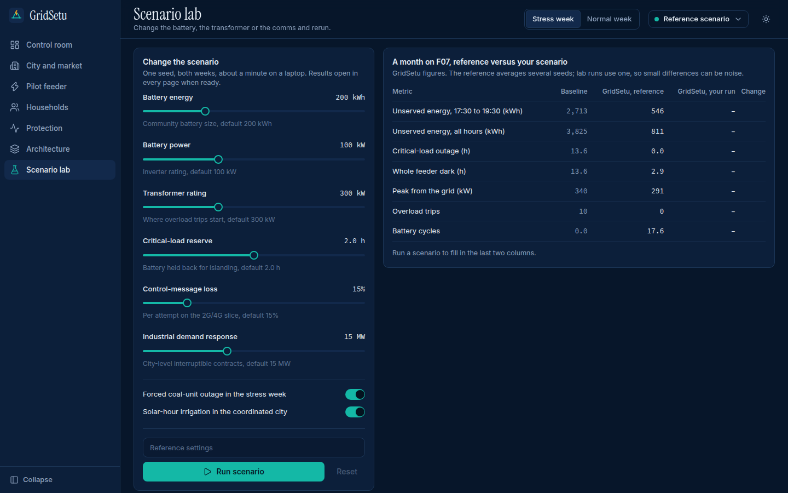

- **Architecture:** the five grid layers, each showing what it is doing at the playhead.
- **Scenario lab:** change the battery, transformer rating, critical-load reserve, control-message loss, industrial DR, the forced outage or solar-hour irrigation. The simulator reruns in about 30 seconds with live progress, and the result can be opened on every page.

---

## How it works

### Grid architecture

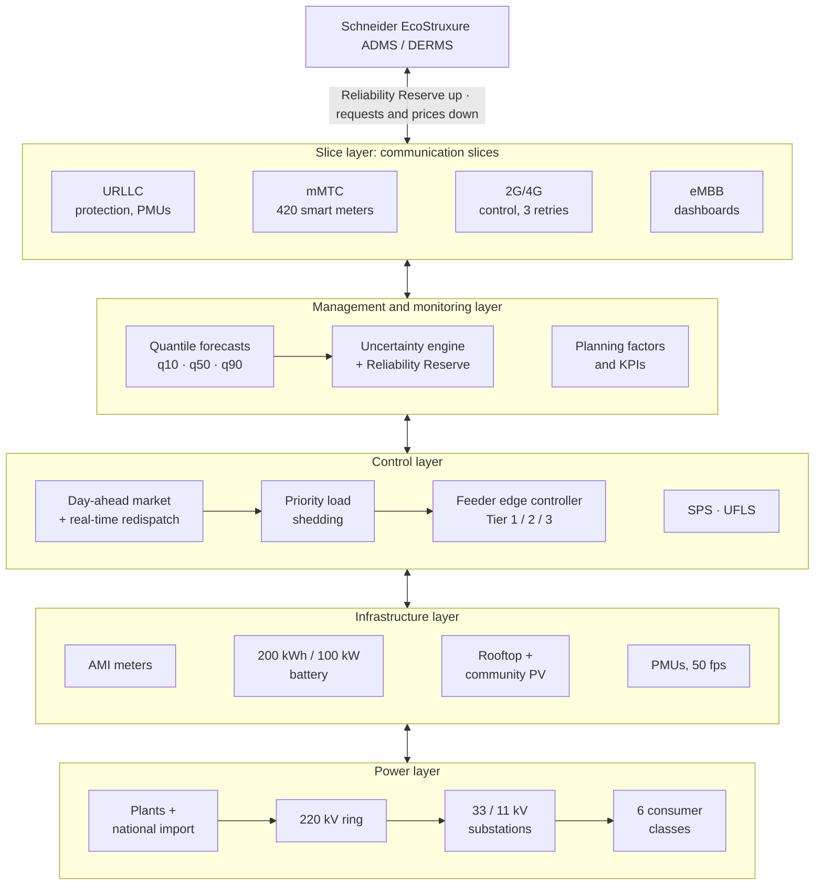

### How power reaches a home

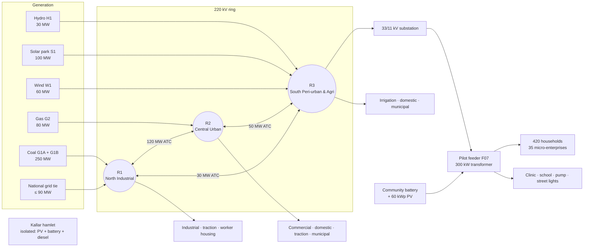

### One simulated week

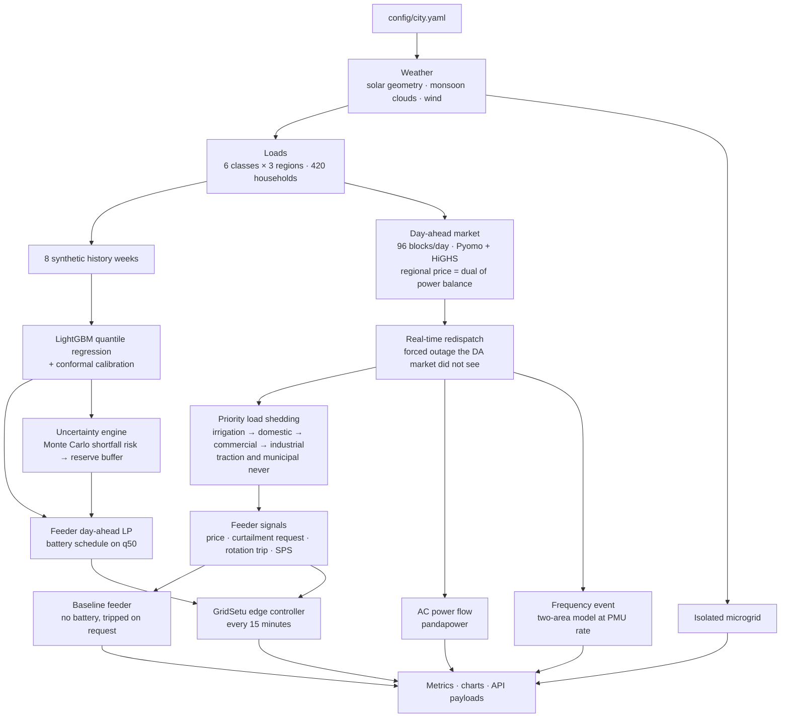

### The edge controller, every 15 minutes


### Reliability Reserve lifecycle

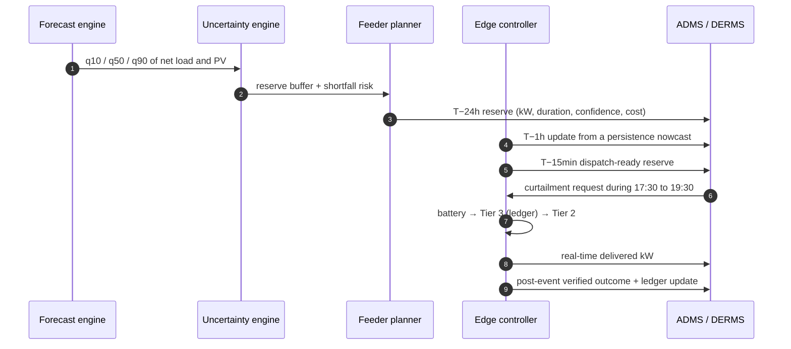

### Front-end data flow

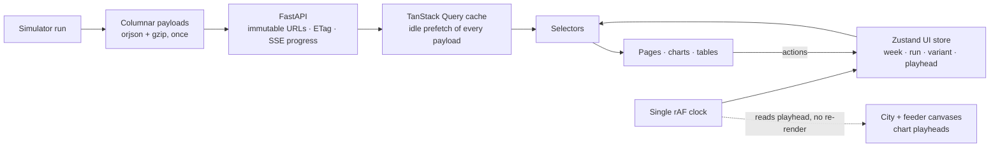

Data flows one way. The server payloads are immutable, so each is fetched once and every week or page switch after that is served from the cache. The canvases and chart playheads read the clock outside React; React re-renders only when the playhead crosses a 15-minute step. Measured playback in headless Chromium held a steady 16.7 ms per frame.

---

## Results

Monthly composite of three normal weeks and one stress week (a forced 125 MW coal outage and two overcast monsoon days), averaged over three weather and load seeds.

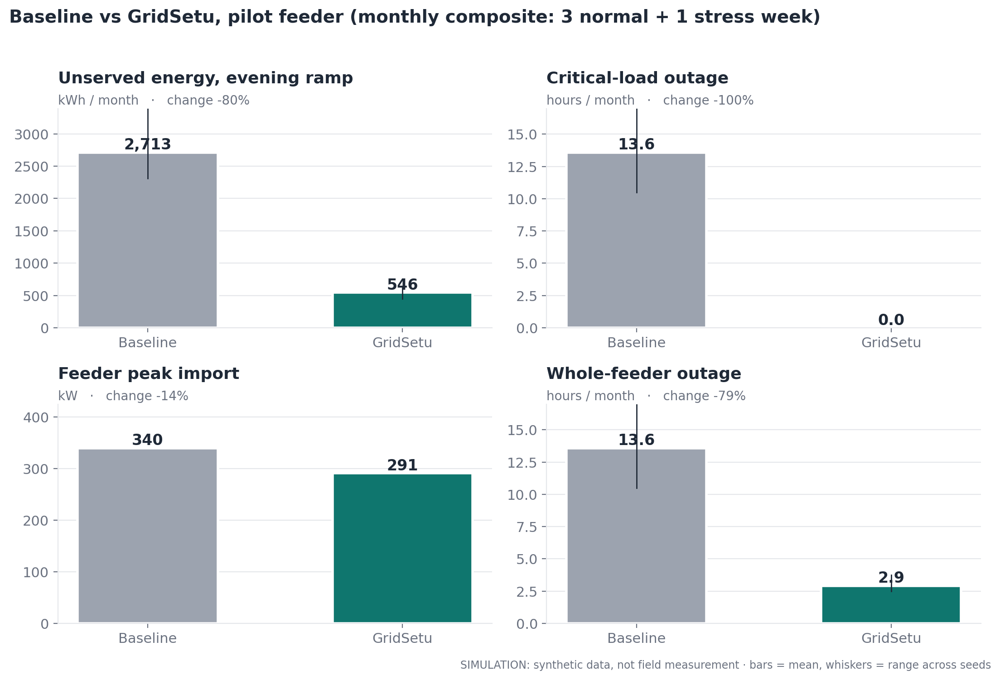

| Metric, per month | Baseline | GridSetu | Change | + city DR |
|---|--:|--:|--:|--:|
| Unserved energy, 17:30 to 19:30 | 2,713 kWh | 546 kWh | −80% | 403 kWh |
| Unserved energy, all hours (net of rebound) | 3,825 kWh | 811 kWh | −79% | 572 kWh |
| Critical-load outage | 13.6 h | 0.0 h | −100% | 0.0 h |
| Whole-feeder outage | 13.6 h | 2.9 h | −79% | 2.0 h |
| Transformer overload trips | 10 | 0 | −100% | 0 |
| Peak drawn from the grid | 340 kW | 291 kW | −14% | 291 kW |
| Battery cycles | – | 17.6 | | 17.6 |

*+ city DR* adds city-level solar-hour irrigation and 15 MW of industrial demand response. Seed ranges: baseline evening unserved energy 2,315 to 3,389 kWh; GridSetu 452 to 617 kWh.

**Other studies (stress week)**
- **Fairness:** all 420 homes shared Tier-3 curtailment, at most 4.0 hours each. Gini of paused hours 0.04, with 654 user overrides honoured.
- **Forecast:** the q10 to q90 band covered the actual 83% of the time (nominal 80%), with a median error of 3.9%.
- **City:** energy not served fell from 723 MWh to 494 MWh with solar-hour irrigation and industrial DR. Traction, municipal, commercial and industrial loads were never shed.
- **Protection:** in Case A the frequency nadir was 49.70 Hz and GridSetu's fast response cut special-protection shedding from 62 to 57 MW. In Case B (islanding) the nadir was 49.16 Hz, with two under-frequency stages operating.
- **Isolated microgrid:** unserved energy fell from 613 to 114 kWh per week, diesel run hours from 139 to 116, and wasted solar from 441 to 22 kWh.
- **AC power flow:** the most-loaded 220 kV line peaked at 110% of its thermal rating in 8 samples during the outage. Feeder voltages stayed within 0.99 to 1.03 pu.
- **Planning factors:** city peak 474 MW, load factor 0.70, reserve margin at peak 1.9%.

**Where the model disagrees with earlier estimates**
- **Solar utilisation:** the earlier figure of 61% to 84% is not supported. Daytime load on this feeder always exceeds its 150 kWp of solar, so both scenarios already use about 100% of it.
- **Stress events:** during a 30-hour, 125 MW shortfall a 200 kWh battery cannot supply all the relief requested. The feeder is still tripped for part of the event, but its critical loads stay on.
- **Frequency support:** about 6 MW of fast response from a quarter of the peri-urban feeders is real but small at city scale. Fairness and critical-load protection are the stronger results.

---

## Run it locally

**Requirements:** Python 3.11, Node 20 or newer. About 2 GB of RAM; no GPU needed.

```bash
git clone https://github.com/HUNT-001/gridsetu.git
cd gridsetu
python -m venv .venv && source .venv/bin/activate     # Windows: .venv\Scripts\activate
pip install -r requirements.txt

# build the dashboard once
cd web && npm install && npm run build && cd ..

# start the API and the dashboard
python -m gridsetu serve                              # http://127.0.0.1:8000
```

The first start simulates the reference scenario (3 seeds, about 90 seconds) and caches it in `.cache/runs/`. Later starts are instant.

| Command | What it does |
|---|---|
| `python -m gridsetu serve` | API plus built dashboard on port 8000 |
| `python -m gridsetu run --seeds 3` | Batch study: charts, CSVs and `outputs/summary.txt` |
| `pytest -q` | 15 invariants covering power balance, intertie limits, shedding priority, Tier-1 protection, battery limits, fairness and protection |
| `cd web && npm run dev` | Dashboard with hot reload on port 5173, with the API proxied |
| `cd web && npm run build:demo` | One self-contained HTML file with a data snapshot, for sharing without a server |

**API**

| Route | Returns |
|---|---|
| `GET /api/v1/runs` | Runs and their status |
| `POST /api/v1/runs` | Starts a scenario-lab run from `{"knobs": {...}}` |
| `GET /api/v1/runs/{id}/progress` | Live progress as Server-Sent Events |
| `GET /api/v1/runs/{id}/{resource}?week=stress` | `meta`, `summary`, `city`, `feeder`, `households`, `wams`, `island` or `network` |
| `POST /api/v1/adms/ingest` | Mock ADMS/DERMS ingest of a Reliability Reserve |

---

## Project structure

```
gridsetu/
├── config/city.yaml          every assumption: regions, plants, classes, feeder, comms, protection
├── src/gridsetu/
│   ├── weather.py            solar geometry, monsoon cloud cover, wind, day-ahead weather forecast
│   ├── profiles.py           class load curves, 420-household feeder, synthetic history
│   ├── forecast.py           LightGBM quantile regression with conformal calibration
│   ├── market.py             day-ahead market splitting and real-time redispatch (Pyomo + HiGHS)
│   ├── feeder.py             feeder planner LP, edge controller, islanding, Reliability Reserve
│   ├── reserve.py            uncertainty engine and the reserve object
│   ├── fairness.py           rotation ledger
│   ├── comms.py              communication slices
│   ├── network.py            220/33/11 kV AC power flow (pandapower)
│   ├── wams.py               two-area frequency dynamics, SPS and UFLS
│   ├── island.py             isolated solar, battery and diesel microgrid
│   ├── metrics.py            load, diversity, demand, capacity and plant use factors
│   ├── runner.py, plots.py   batch study and deck charts
│   └── api/                  FastAPI service and payload packing
├── web/                      React 19, Vite, Tailwind v4, Radix/shadcn-style components
│   └── src/
│       ├── components/city/  canvas city scene, feeder inset, playback
│       ├── components/       uPlot charts, virtualised table, UI primitives
│       ├── lib/              API client, query hooks, UI store and clock
│       └── pages/            control room, city, feeder, households, protection, architecture, lab
├── tests/test_invariants.py
└── docs/images/              screenshots and animations used in this README
```

**Stack**

| Area | Tools |
|---|---|
| Simulation | Pyomo with HiGHS, pandapower, LightGBM, NumPy, pandas |
| Service | FastAPI, orjson, Server-Sent Events |
| Interface | React 19, Vite, Tailwind v4, Radix primitives (shadcn-style), TanStack Query and Virtual, Zustand, uPlot, GSAP, Lenis |
| Type and icons | Inter, Instrument Serif and Source Code Pro (self-hosted); one inline SVG sprite of Lucide icons |

---

## Modelling assumptions

All values live in [`config/city.yaml`](config/city.yaml).

- **Pilot feeder:**
  - 420 households, 35 micro-enterprises, 340 kW peak.
  - A 300 kW transformer, so the evening peak overloads it. This is the overloaded-transformer case RDSS targets.
  - Community battery 200 kWh / 100 kW, with 2 hours of Tier-1 energy held back for islanding.
- **Protection trips:** probabilistic above the transformer rating, with one hour to restore.
- **DISCOM relief:**
  - Requests equal the regional domestic shed fraction times the feeder's load.
  - GridSetu must deliver at least 95% of a request, or it is rotation-tripped like any other feeder. This stops it from free-riding on its neighbours.
- **Shedding order:** revenue-driven, as at a cash-strapped DISCOM. Irrigation and domestic loads go first; traction and municipal are never shed.
- **Market:** ATC-based market splitting with a ₹10/kWh exchange ceiling. Thermal units stay within ±5 MW of their day-ahead schedule in real time.
- **Communications:** 15% packet loss on the 2G/4G control slice, with 3 retries.
- **Forecasts:** trained on 8 synthetic history weeks.

## Limitations

- All data is synthetic. No live DISCOM telemetry or feeder measurement was used.
- The cooperative ownership model has not had legal review.
- The market is a single-period-per-block LP without unit commitment. Real time assumes perfect foresight for fast units within each day.
- The frequency model is a two-area aggregate, not a full dynamic network model.
- The forecasts have not been backtested on real feeder data.

## Roadmap

- [x] **Phase 1:** multi-layer simulator, market, feeder controller, protection studies, tests
- [x] **Phase 3:** control-room dashboard, API, mock ADMS ingest, scenario lab
- [ ] **Phase 2:** city-wide GridSetu fleet, PyPSA unit commitment, OpenStreetMap city geometry
- [ ] **Phase 4:** operator copilot on the Claude API with tool calls into the simulator (Ollama fallback), plus MQTT/TimescaleDB live replay

---

<div align="center">
<sub>Built by Vakkalagadda Tanush Pavan (<a href="https://github.com/HUNT-001">@HUNT-001</a>) · Amrita Vishwa Vidyapeetham, Coimbatore</sub>
</div>
